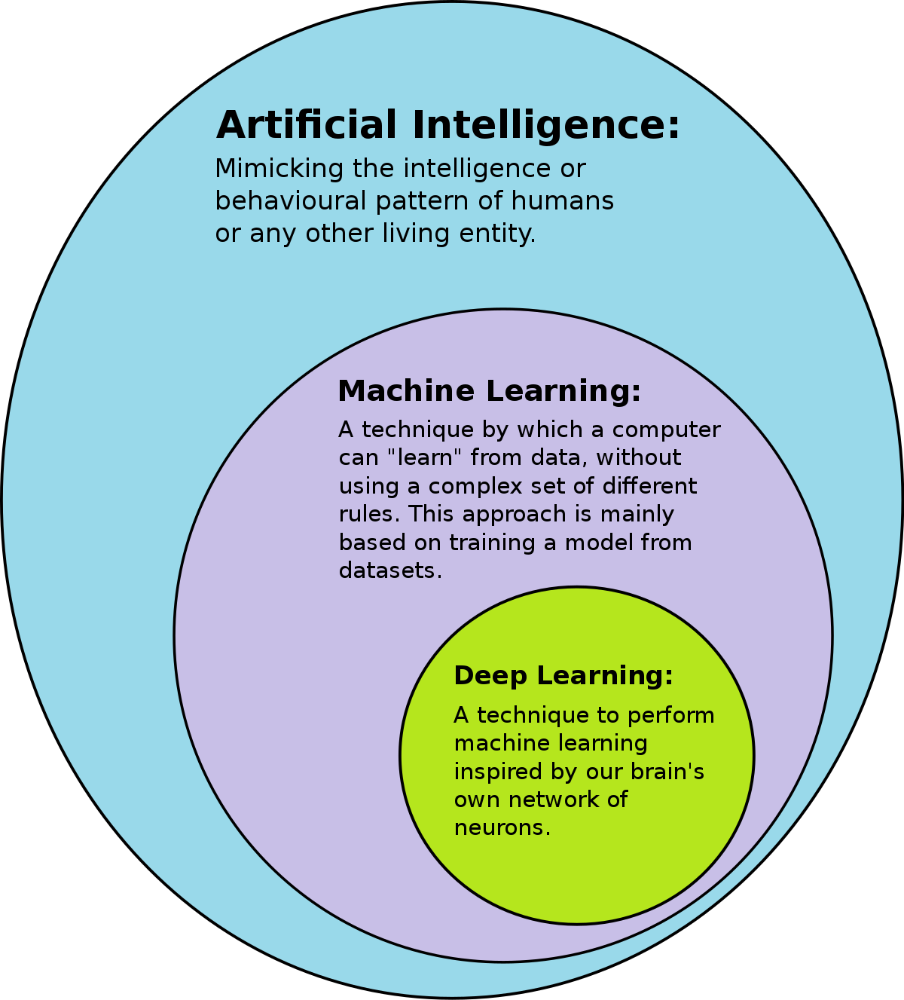

# So, what really is AI?

___

&nbsp;&nbsp;&nbsp;&nbsp;This blog will cover the basic terminologies and definitions conerning artificial intelligence. To pave a good foundation towards higher understanding forward, we should have a good understanding of what AI is, and what it isn't.

&nbsp;&nbsp;&nbsp;&nbsp;In the public understanding, there are 3 major terms regarding AI: artificial intelligence, machine learning, and deep learning. These three are closely related, yet very distinct and very defind of their own. All the three terms AI, ML and DL are often used interchangeably and at times can be confusing.  In summary, AI is a very broad term used to describe any system that can perform tasks that usually require the intelligence of a human. ML is a subset of AI whilst DL is a subset of ML algorithms.

&nbsp;&nbsp;&nbsp;&nbsp;Now that we've established a general understanding of the definitions, we can get into what really matters in this course, machine learning! Using neural networks!

## Neural networks

___

&nbsp;&nbsp;&nbsp;&nbsp;Neural nets are essentially a product that humans made up to imitate the brain. As our brains have neurons with connections to each other, sending signals through electricity, neural nets do essentially the same. They are literally neurons that can communicate with each other, placed in layers. The neural nets will have at least an input and output layer. When neural networks are constructed, the neurons are literally blank, and requires learning to tune the model to give off useful output.

##  How does a machine learning model learn?

___

&nbsp;&nbsp;&nbsp;&nbsp;Neural networks go through *training* to tunr their neurons (a.k.a *weights*) to give accurate output. The training is conducted in loops, and in each loop a lot of cool things happen.
1. **Preparing the inputs**: e.g. pictures and a label of what that data is. Put all the input data into a `Dataloader`, which essentially will give off the data in batches to train
2. **Feeding the data**: the Dataloader feeds the data into the model, taking in the calculations from the weights of all the neurons. Generating an output, called *Predictions*.
3.**Calculate loss**: in each batch, after getting the pridictions, the model will pass the predictions through a `loss function`. The function calculates how far the predictions are off from the correct labels (less is better).
4.**Calculate gradients**: When the model gets the loss values of all the batches, it will calculate the `Gradients`, which is like a map of how much the model has improved. The gradient will then be passed into an Optimizer, which will update the weights.

&nbsp;&nbsp;&nbsp;&nbsp;Going through steps 1-4, with each batch, is called an *iteration*. and for the batch that gets passed in every iteration, is called an *epoch*. 1 training loop is literally 1 epoch.

&nbsp;&nbsp;&nbsp;&nbsp;After the training is finished, the model will have to evaluate itself with the data it has never seen before, called a `Validation set`. This is intended to make the model prove that it really fulfills the objective, and not just exploiting certain irrelevant features in the training set.

&nbsp;&nbsp;&nbsp;&nbsp;In this blog, we have gone through the definitions of what ML really is, and explored a bit into how it trains. Next time, we're going to talk about what these seemingly simple models are truly capable of.